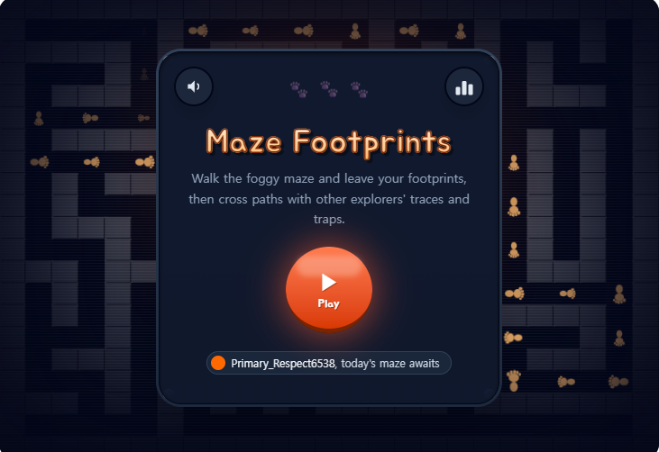
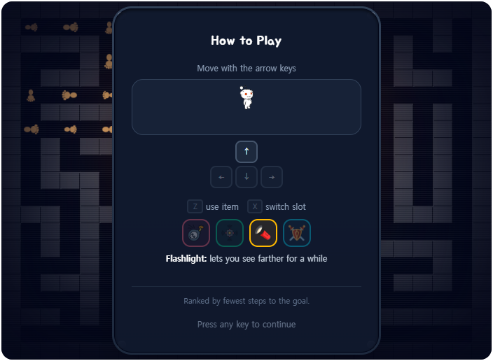
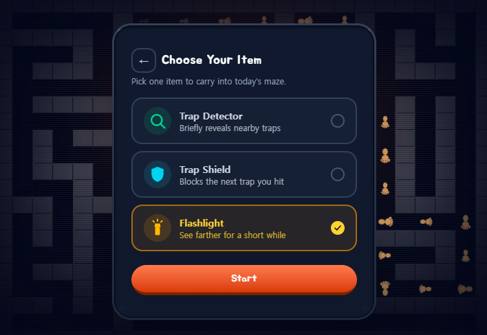
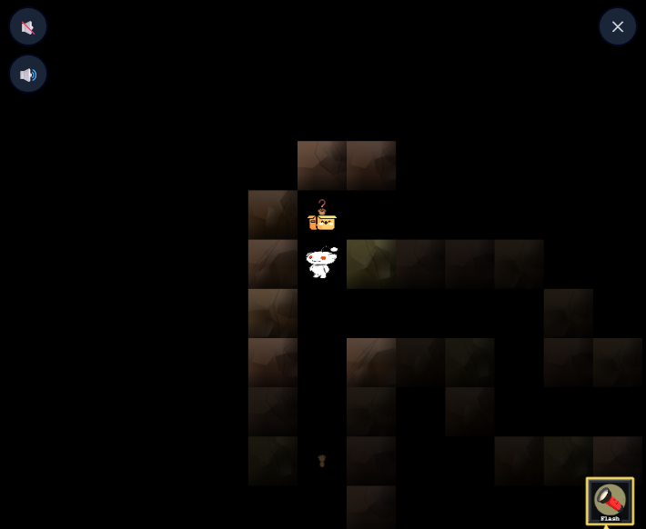
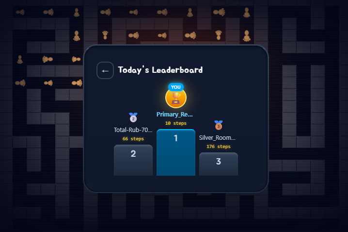

# 미로의 발자국 (가제)

Reddit's Games with a Hook Hackathon 제출작. Devvit Web 위에서 동작하는 **탑다운 그리드 비동기 협동/경쟁 미로 게임**입니다.

시야는 좁은 안개(블라인드)로 덮여 있고, 내가 지나간 길만 내 화면에서 안개가 걷힙니다. 그 과정에서 남긴 **발자국**은 다른 시간에 접속한 유저에게 힌트가 되고, 곳곳에 설치된 **함정 4종**과 **아이템**은 서로 다른 시간대의 유저끼리 영향을 주고받습니다. "혼자 접속해서 혼자 풀고 끝"이 아니라, 내가 놓은 함정에 누가 걸렸을지 궁금해서 다시 방문하게 만드는 것이 이 게임의 hook입니다.

매일 자정 맵이 리셋되며, 클리어 타임 기준 리더보드가 제공됩니다. 상세 기획은 [`docs/product-specs/PRD-v1.md`](docs/product-specs/PRD-v1.md) 참고.

## 미리보기

### 플레이 영상

<video src="submission-assets/video/Maze_FootPrint_PlayVideo.mp4" controls width="720">
  영상이 재생되지 않으면 직접 다운로드하세요: <a href="submission-assets/video/Maze_FootPrint_PlayVideo.mp4">Maze_FootPrint_PlayVideo.mp4</a>
</video>

### 스크린샷

| 시작 화면 | How to Play | 아이템 선택 |
|:---:|:---:|:---:|
|  |  |  |
| 오늘의 미로 안내 + PLAY | 조작법 + 함정/아이템 소개 | 시작 전 로드아웃 1개 선택 |

| 인게임 (안개 속 미로) | 오늘의 리더보드 |
|:---:|:---:|
|  |  |
| 밟기 전엔 정체를 알 수 없는 미스터리 박스 | 걸음 수 기준 순위, 매일 자정 리셋 |

## 캐릭터 상태 표현

캐릭터(`public/sprites/Character-*.png`, 레딧 스누)는 평소엔 `Character-normal.png` 모습이지만, **함정 4종에 걸리면 그 함정을 상징하는 그림으로 잠깐 바뀌었다가**(효과가 지속되는 동안 유지) 원래 모습으로 돌아옵니다 — 색 틴트만으로는 어떤 함정에 걸렸는지 한눈에 안 들어온다는 점을 보완하기 위함입니다(`src/client/game.tsx`의 `flashPlayerTrap`/`refreshPlayerTrapVisual`).

| 상태 | 이미지 | 지속 시간 |
|------|--------|-----------|
| 평소 | `Character-normal.png` | - |
| 슬라이드 함정 | `Character-slide.png` | 벽에 부딪힐 때까지 |
| 리스폰 함정 | `Character-respawn.png` | 1.6초 |
| 시야차단 함정 | `Character-blind.png` | 5초 |
| 역방향 함정 | `Character-reverse.png` | 4초 |

아이템(손전등/쉴드/함정 탐지기)을 주웠을 때는 캐릭터 이미지 교체 대신 짧은 색 틴트(`flashPlayer`)로만 표시됩니다 — 함정과 달리 "무엇에 걸렸는지"가 아니라 "무엇을 얻었는지"라 화면 상단 토스트 문구로 충분히 구분되기 때문입니다. 함정 탐지기 전용 이미지(`Character-detector.png`)도 준비돼 있지만, 기존 함정 이미지 시스템(`activeTrapEffects`)과 얽힐 위험이 있어 아직 실제로는 쓰이지 않고, 대신 반경 내 다른 유저 함정을 색상 링 마커로 잠깐 표시하는 방식으로 구현돼 있습니다(자세한 이력은 [`docs/wbs.md`](docs/wbs.md) 참고).

## 기술 스택

| 영역 | 스택 |
|------|------|
| 플랫폼 | [Devvit Web](https://developers.reddit.com/docs) (`@devvit/web`) — 구 blocks API(`@devvit/public-api`) 미사용 |
| 클라이언트 - UI | React 19 (스플래시/메뉴 화면) |
| 클라이언트 - 게임 | Phaser 4 (미로 플레이 화면) |
| 서버 | Hono + tRPC 11, Redis (발자국·함정·랭킹 저장) |
| 공통 | TypeScript, Zod |
| 빌드/검증 | Vite, Tailwind CSS 4, ESLint, Prettier, Vitest |

## 시작하기

### 사전 준비물
- Node.js `>= 22.2.0`
- Reddit 개발자 계정 + Devvit CLI 로그인: `npm run login` (`devvit login`)

### 팀원이면 먼저
1. [`CLAUDE.md`](CLAUDE.md) 확인 — 프로젝트 핵심 규칙 + 문서 지도
2. `/role <이름>` 실행 (예: `/role 임소리`) — 팀 내 담당 역할을 Claude에게 알림
3. [`docs/setup-guide.md`](docs/setup-guide.md) 따라 개발환경 셋업

### 로컬 실행
```bash
npm install
npm run dev   # devvit playtest — 팀 공용 dev 서브레딧에서 실시간 플레이테스트
```

## 스크립트

| 명령어 | 설명 |
|--------|------|
| `npm run dev` | `devvit playtest` — 로컬 변경사항을 dev 서브레딧에 실시간 반영 |
| `npm run build` | `vite build` — 클라이언트 번들 빌드 |
| `npm run type-check` | `tsc --build` — 타입 검사 |
| `npm run lint` | `eslint 'src/**/*.{ts,tsx}'` |
| `npm run prettier` | `prettier --write .` — 포맷팅 |
| `npm run test` | `vitest run` — 테스트 실행 |
| `npm run deploy` | type-check → lint → `devvit upload` (배포용 빌드 업로드) |
| `npm run launch` | `deploy` → `devvit publish` (최종 제출 시에만 사용) |

## 프로젝트 구조

```
src/
  client/   React(splash.tsx) + Phaser(game.tsx) 클라이언트, 안개/맵 패턴 로직
  server/   Hono + tRPC 서버, Redis 연동 core/routes
  shared/   클라이언트·서버 공통 타입/맵 데이터/API 계약
public/     정적 에셋
docs/       기획·설계·팀 운영 문서 (아래 문서 지도 참고)
devvit.json Devvit Web 설정 — post entrypoint, cron(자정 리셋), dev 서브레딧
```

## 핵심 문서 지도

| 문서 | 내용 |
|------|------|
| [`docs/product-specs/PRD-v1.md`](docs/product-specs/PRD-v1.md) | 게임 기획/스펙 |
| [`docs/team-roles.md`](docs/team-roles.md) | 팀 역할 구조 |
| [`docs/wbs.md`](docs/wbs.md) | 팀 진행 상황(WBS) |
| [`docs/schedule.md`](docs/schedule.md) | 마감 역산 일정 |
| [`docs/setup-guide.md`](docs/setup-guide.md) | 개발환경 셋업 |
| [`CONTRIBUTING.md`](CONTRIBUTING.md) | Git 전략 / 기여 가이드 |
| [`docs/design-docs/vision-system.md`](docs/design-docs/vision-system.md) | 시야(안개) 밸런스 상세 |
| [`docs/design-docs/traps.md`](docs/design-docs/traps.md) | 함정 상세 스펙 |
| [`docs/design-docs/items.md`](docs/design-docs/items.md) | 아이템 후보/확정 (⚠️ 미확정) |
| [`docs/ref/devvit-conventions.md`](docs/ref/devvit-conventions.md) | Devvit Web 코드 규칙 |

## 팀

3인 체제로 진행합니다. 담당 영역 상세는 [`docs/team-roles.md`](docs/team-roles.md) 참고.

| 이름 | 담당 |
|------|------|
| 임소리 | 게임플레이/Phaser — 그리드 이동, 안개 시야, 함정·아이템 이펙트 |
| 배영환 | 백엔드/비동기 데이터 — Redis 모델, tRPC/Hono API, 자정 리셋, `devvit.json` |
| 송원호 | UI·콘텐츠·통합 — React UI, 맵/아트/사운드, QA, 제출물 준비 |

## 기여 규칙

- `main` 직접 푸시 금지 — 반드시 PR
- 작업 브랜치: `feature/<이름>-<작업내용>`
- 담당 영역이 아닌 코드를 건드릴 경우 해당 영역 담당자를 PR 리뷰어로 포함

자세한 내용은 [`CONTRIBUTING.md`](CONTRIBUTING.md) 참고.

## 라이선스

[BSD-3-Clause](LICENSE)
